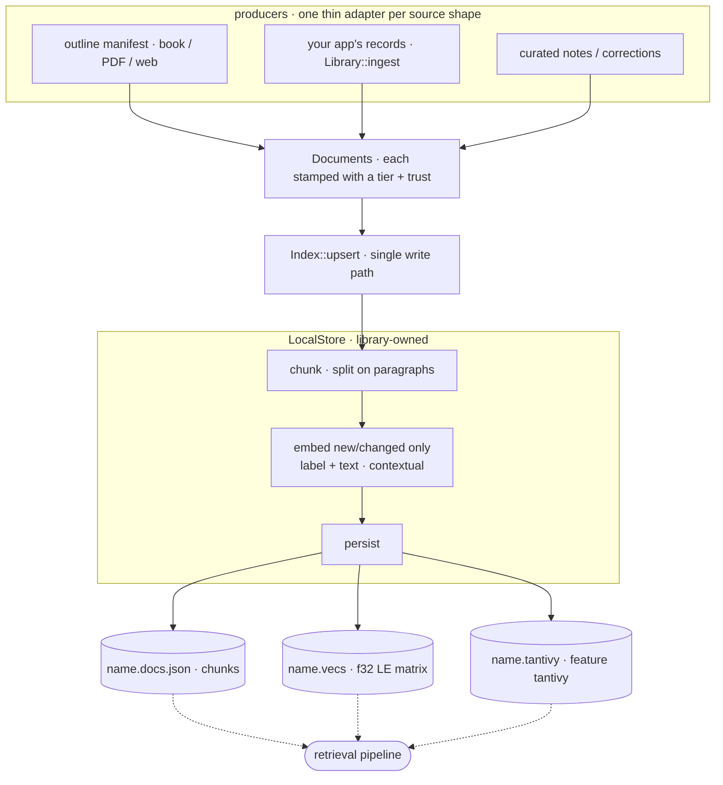
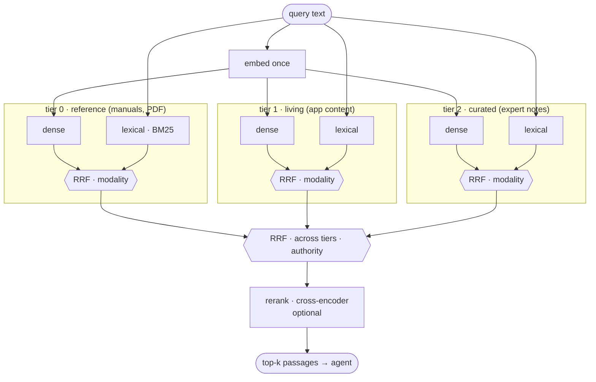

# Enki

A **provider-agnostic agentic RAG library** in Rust — named after the Sumerian
god of wisdom and knowledge.

Retrieval is a **tool the agent calls**, not context stuffed into the prompt. The
LLM provider *and* the domain (scope, corpus) are **injected via config** — the
library holds no opinion on either. The same binary can serve a technical-docs
assistant or a narrative knowledge base with zero domain code.

> **Status:** early / proof-of-concept. The retrieval spine works end-to-end
> (indexing → hybrid-ready search → citation-grounded agentic answers). APIs will move.

## Why

- **Retrieval-as-tool.** The agent decides when to search, reformulates, and
  stops when it has enough grounded evidence. This keeps the cached prompt prefix
  stable (tool results extend the suffix) — unlike static RAG which rewrites the
  prefix every query.
- **Provider-agnostic.** LLM and embeddings via [genai]; swap OpenAI / Anthropic /
  Gemini / Ollama / … by config. LLM and embedder may be different providers.
- **Grounded & citeable.** Every claim cites a retrieved passage by handle; the
  library resolves handles to provenance (section + page range) and can verify
  quotes against the source. The model never emits raw ids or invents page numbers.
- **Modular search.** Dense + lexical (BM25) + rerank compose behind one
  `Retriever` seam; a hybrid backend (e.g. Qdrant) is simply one source. Fusion is
  two-axis: relevance (RRF, within a collection) then authority (across tiers).

## Architecture

| Side | Modules | Role |
|------|---------|------|
| **Indexing** (occasional) | `indexing`, `embed`, `model` | manifest → sections → chunks (title path prepended for contextual embedding) → persisted vectors |
| **Retrieval** (per query) | `retrieval`, `search` | `Retriever` backends → `SearchEngine` (RRF + tier fusion + optional rerank) |
| **Inference** | `agent`, `prompt`, `registry` | homemade agentic loop (`search` + `answer` tools), handle registry, citation resolution |
| **Glue** | `config`, `providers` | env-driven config; genai client construction |

See [`SPEC.md`](./SPEC.md) for the full design rationale.

## Indexing pipeline

Indexing runs **occasionally** (not per query). A **producer** turns a source into
`Vec<Document>` and hands it to the single write path, `Index::upsert`; the library
owns chunking and embedding, so a producer is a thin adapter for one source
*shape* — a paginated book or PDF (via an outline manifest), an exported knowledge
base, a web export, your app's own evolving records, a set of curated corrections.
The shape barely matters; what matters is the **tier** you stamp on each
`Document` — its authority rank. The built-in `manifest_documents` handles outline
manifests; any other shape is a few lines (see [`examples/`](./examples)).



Each source lands in its own **collection at a tier**, so you index a static
reference tier once and keep re-upserting the living tiers as they change — cheaply,
because upsert is **incremental** (only new or text-changed chunks are re-embedded,
keyed by content) and embedding is **contextual** (the provenance label is prepended
to the chunk text, so titles shape the vector). The lexical index is rebuilt from
the same chunk set on every write, so dense and BM25 never drift apart.

## Retrieval composition

Retrieval is a **tool the agent calls**. One `SearchEngine::search(query, k, filters)`
composes everything behind a single seam, fused on **two axes** — and the second,
**tiers**, is enki's organizing idea.

1. **Modality (within a tier)** — each `Retriever` (dense vectors, lexical BM25, or
   a single hybrid backend) returns a ranked list; **RRF** fuses them by rank, so
   scores from different models never need to be comparable.
2. **Tier / authority (across tiers)** — sources are grouped into collections by
   **tier**, an authority rank assigned at index time (a stable reference tier low;
   your living, then curated content higher). Every tier is searched, and the
   per-tier lists are fused by **RRF** — so a higher tier sits *beside* the
   reference for the same query rather than replacing it, with no hard overrides
   or per-query routing. `Filters { trust_min }` gates the same authority axis at
   query time. An optional cross-encoder **reranker** reorders the merged
   candidates before the final `k`.



Tiers are the only opinion; everything else is a trait (`Retriever`, `Fuser`,
`Reranker`, `Embedder`) — swap a brute-force scan for Qdrant, add BM25, or plug a
custom backend without touching the engine. Backends are compile-time features
chosen at runtime (see below).

Use it directly, without the agent — raw ranked passages for your own harness:

```rust
let library = Library::open(&config).await?;
for Scored { chunk, score } in library.search("your query", 8).await? {
    println!("{score:.3}  [tier {}]  {}", chunk.tier, chunk.provenance.label);
}
```

## Quickstart (local, Ollama)

```bash
cp .env.example .env         # then edit models/endpoints
# point ENKI_MANIFEST at a document.manifest.json (hierarchical outline + content)

cargo run -- index                          # build the index (once)
cargo run -- ask "your question here"       # blocking, prints answer + citations
cargo run -- stream "your question here"    # streams the answer as it is generated
```

Any [genai]-supported provider works; set `ENKI_LLM_MODEL` / `ENKI_EMBED_MODEL` and
the matching endpoint/credentials.

### As a library

```rust
let library = enki::library::Library::open(&config).await?;   // hides all the wiring

let answer = library.ask("How does a dice roll work?").await?;
println!("{}", answer.markdown);                         // grounded, with [n] markers
for c in &answer.citations { /* c.number, c.provenance, c.quote_verified */ }

// or stream tokens as they arrive (Search / Token / Done events)
let mut events = std::pin::pin!(library.stream("..."));
while let Some(ev) = events.next().await { /* … */ }

// manage living content (idempotent by document id)
library.ingest("instance", documents).await?;
library.delete("instance", &["npc:old-villain".into()]).await?;

// filter retrieval (trust floor, tags) on any read path
let filters = enki::retrieval::Filters { trust_min: Some(TrustStatus::Endorsed), tags: vec![] };
let answer = library.ask_with("…", filters.clone()).await?;
let hits = library.search_with("…", 8, filters).await?;   // raw passages, no LLM
```

Bring your own parts (e.g. a fastembed embedder, custom collections) instead of
`open`'s genai defaults — the escape hatch that keeps `ask`/`stream`/`ingest`:

```rust
let library = Library::builder(engine, embedder, llm_client, "gemini-2.5-flash")
    .system(system_prompt).cache_dir(".cache").top_k(8).build();
```

See [`examples/query.rs`](./examples/query.rs) for a runnable version.

## Evaluation

A provider-agnostic eval harness replays a fixed question set and measures
**relevance** (expected facts present, expected source cited) and **latency**. The
embedder — hence the index — stays fixed, so you re-run the same harness against a
different LLM by swapping `ENKI_LLM_MODEL` / `ENKI_LLM_ENDPOINT`.

```bash
export ENKI_MANIFEST=examples/ressources/dnd/books/FR_SRD_CC_v5_2_1/document.manifest.json
export ENKI_CACHE_DIR=.cache-dnd
cargo run -- index                                              # build corpus (once)
cargo run --example ingest_srd_spells                           # build spells (one doc per spell)
cargo run --example ingest_campagne -- examples/ressources/dnd/campagne   # build instance
cargo run --example eval                                        # replay + report
```

The question set ([`eval_questions.json`](./examples/ressources/dnd/eval_questions.json))
spans the library's differentiators: book-only facts, campaign-only narrative,
cross-collection **tier fusion** (book rule + character sheet), **house-rule
overrides** (campaign authority beats the manual), multi-hop, and out-of-corpus
refusal. A small freely-licensed D&D SRD + simulated campaign ships under
[`examples/ressources/dnd`](./examples/ressources/dnd) so the eval is reproducible.

## Observability

The library instruments its hot paths (search, embedding, agent rounds) with
[`tracing`] spans and structured events — it installs **no** subscriber itself.

- Default console sink (feature `console`, on by default): call
  `enki::telemetry::init_console()` once; it logs to stderr, filtered by `ENKI_LOG`
  (`ENKI_LOG=enki=debug` for per-search timings, `off` to silence). The CLI and
  examples already call it.
- Your own sink: build with `--no-default-features` and install any `tracing`
  subscriber/layer (file, JSON, an in-app buffer, a closure) — the natural path for
  a Tauri backend. `tracing`'s `Subscriber` is the "trait" seam, a layer closure is
  the "fn" seam; enki adds no logging abstraction of its own.

## Configuration

All config is environment-driven (loaded from `.env` if present). See
[`.env.example`](./.env.example): `ENKI_LLM_PROVIDER`, `ENKI_LLM_MODEL`,
`ENKI_LLM_ENDPOINT`, `ENKI_LLM_API_KEY`, `ENKI_EMBED_PROVIDER`, `ENKI_EMBED_MODEL`,
`ENKI_EMBED_ENDPOINT`, `ENKI_EMBED_API_KEY`, `ENKI_MANIFEST`, `ENKI_LIBRARY_SCOPE`,
`ENKI_TOP_K`,
`ENKI_MAX_ROUNDS`, `ENKI_BACKEND`, `ENKI_CACHE_DIR`, `ENKI_QDRANT_URL`,
`ENKI_QDRANT_API_KEY`, `ENKI_SPARSE`, `ENKI_SPARSE_MODEL`, `ENKI_QDRANT_FUSION`,
`ENKI_LEXICAL`, `ENKI_RERANK`, `ENKI_RERANK_CACHE`, `ENKI_LOG`.

`Config` is **grouped by concern** — `embed`, `llm`, `retrieval`, `agent`,
`indexing` — so each part of the code (and each consumer) depends only on what it
uses: a retrieval-only harness builds an `EmbedConfig` + `RetrievalConfig` and
never touches the LLM/agent config. Each group has its own `from_env`, and
`Config::from_env` composes them.

### Providers

`ENKI_LLM_PROVIDER=ollama` targets a local endpoint; any other value uses genai's
native routing — the adapter is picked from the model name (`gemini-…`, `gpt-…`,
`claude-…`). The **API key is injected through config** (`Config.llm_api_key` /
`Config.embed_api_key`), so an embedding app supplies it from its own
settings/keychain — no process env var required. If left `None`, genai falls back
to the provider's own env var (`GEMINI_API_KEY`, …), convenient for the CLI.

LLM and embedder are configured independently, so a cloud LLM can pair with a local
embedder (keep embeddings on the model the index was built with):

```rust
let mut cfg = Config::from_env();
cfg.llm.provider = "gemini".into();
cfg.llm.model = "gemini-2.5-flash".into();
cfg.llm.api_key = Some(user_settings.gemini_key);   // from the app, not the env
let library = Library::open(&cfg).await?;
```

```bash
# CLI equivalent (env fallback):
ENKI_LLM_PROVIDER=gemini ENKI_LLM_MODEL=gemini-2.5-flash ENKI_LLM_API_KEY=… \
  cargo run -- ask "..."   # embedder stays ENKI_EMBED_PROVIDER=ollama / bge-m3
```

### Store backend (local · Qdrant)

`ENKI_BACKEND` picks where vectors live — the read *and* write path:

- `local` (default): on-disk vectors + brute-force scan. Zero infra; ideal for an
  embedded desktop app. Persisted under `ENKI_CACHE_DIR`.
- `qdrant` (feature `qdrant`): a [Qdrant] server. HNSW retrieval with `trust_min`
  pushed down as a server-side filter, and `ingest` / `delete` write straight to
  it. Dense, or **hybrid** (dense + sparse) — see below.

```bash
ENKI_BACKEND=qdrant ENKI_QDRANT_URL=http://localhost:6334 \
  cargo run --example qdrant_smoke --features qdrant     # ingest → search → ask
```

`ENKI_QDRANT_API_KEY` is injected via config (Qdrant Cloud); `None` for a local
instance. `tantivy` is a local-file index, so it is rejected with the `qdrant`
backend — use `ENKI_SPARSE` for Qdrant-side lexical.

**Hybrid (dense + sparse).** `ENKI_SPARSE` adds a sparse (lexical) vector fused
with the dense one **server-side** (`ENKI_QDRANT_FUSION=rrf|dbsf`), in one Query
API call. To the engine it is still a single `Hybrid` source, so fusion/rerank
above are untouched. The collection is created with named `dense` + `sparse`
vectors (`Modifier::Idf`) — switching a dense-only collection to hybrid needs a
reindex. Two drivers, both behind the public `SparseEmbedder` trait (bring your
own via `Library::builder`):

- `hashed` — zero-dep, offline, model-free: hashed term-frequencies + server-side
  IDF (BM25-ish). Multilingual, wasm-safe, no ONNX. The lightweight default.
- `fastembed` (feature `fastembed`) — a learned sparse model: `bge-m3`
  (multilingual, same family as the dense bge-m3) or `splade` (English).

The right sparse model depends on **your** corpus and language — the library ships
the mechanism and two drivers, not an opinion. Measure with `retrieval_eval`.

### Search backends

Backends are compile-time features; the active one is chosen at runtime and the
engine errors if you select one that wasn't compiled in.

```bash
cargo run --features tantivy -- index          # build dense + lexical indexes
ENKI_LEXICAL=tantivy cargo run --features tantivy -- ask "..."   # hybrid retrieval
```

`ENKI_LEXICAL=none` (default) is dense-only; `tantivy` adds a BM25 source fused
with dense via RRF. `ENKI_RERANK=fastembed` adds a cross-encoder second stage
(bge-reranker-v2-m3) that reorders the fused candidates; `ENKI_RERANK_CACHE` points
at an existing model cache to skip the ~2 GB download.

Note: on the bundled D&D eval, dense-only (bge-m3) already retrieves precise
passages well (recall@5 = 100%, MRR 0.96 via the retrieval eval below), so neither
BM25 nor reranking improve it here — naive equal-weight RRF even *hurt*. They earn
their place on larger, noisier corpora where the gold passage is retrievable but
mis-ranked (recall@20 ≫ recall@5). Measure before enabling.

### Retrieval eval

`retrieval_eval` scores retrieval in isolation (no LLM): recall@5, recall@20, MRR
against gold passages. This is the tool to decide whether a backend helps — the
end-to-end answer eval is dominated by model-generation noise.

```bash
ENKI_LEXICAL=none cargo run --features tantivy --example retrieval_eval
```

## Data

Corpus data is **not** committed (`/data` is gitignored) — bring your own and mind
its license. A small freely-licensed sample dataset will be added under a tracked
directory. See `SPEC.md` for the manifest format.

## Roadmap

- [x] Section-based chunking + contextual embedding (title path)
- [x] Dense brute-force retriever + modular `SearchEngine` (two-axis fusion)
- [x] Agentic loop, handle registry, citation resolution + quote verification
- [x] Binary vector store (`.vecs`/`.ids`); RAM by default, mmap under `fs`
- [x] Second collection / tier (multi-collection fusion)
- [x] BM25 (Tantivy) lexical retriever, fused with dense (feature `tantivy`, `ENKI_LEXICAL`)
- [x] Cross-encoder reranking (fastembed / bge-reranker-v2-m3; feature `fastembed`, `ENKI_RERANK`)
- [x] Pure retrieval eval (recall@k / MRR, LLM-free) + deterministic decoding
- [x] Agentic-loop robustness (stale/dup guard, no-blank fallback, budget cap)
- [x] Example producers: manifest (corpus), campaign vault (instance), per-spell SRD (spells)
- [ ] Outline graph navigation (`open` / `neighbors`)
- [x] Qdrant store backend — dense retrieval + write (feature `qdrant`, `ENKI_BACKEND`)
- [x] Qdrant native hybrid — dense + sparse, server-side fusion (`ENKI_SPARSE`); two
  drivers behind `SparseEmbedder`: hashed-TF (zero-dep) + fastembed (bge-m3/SPLADE)
- [x] Multi-provider LLM (Ollama / Gemini / OpenAI / Anthropic via genai routing)
- [x] Prompt caching (ephemeral CacheControl) on the stable system+tools prefix

## Development

Quality gates run automatically via [lefthook] git hooks (fmt + clippy + test on
commit; `cargo deny` + `cargo machete` on push):

```bash
cargo install lefthook cargo-deny cargo-machete
lefthook install
```

## License

[MIT](./LICENSE) © Michaël DOHR.

[genai]: https://github.com/jeremychone/rust-genai
[lefthook]: https://github.com/evilmartians/lefthook
[Qdrant]: https://qdrant.tech/
